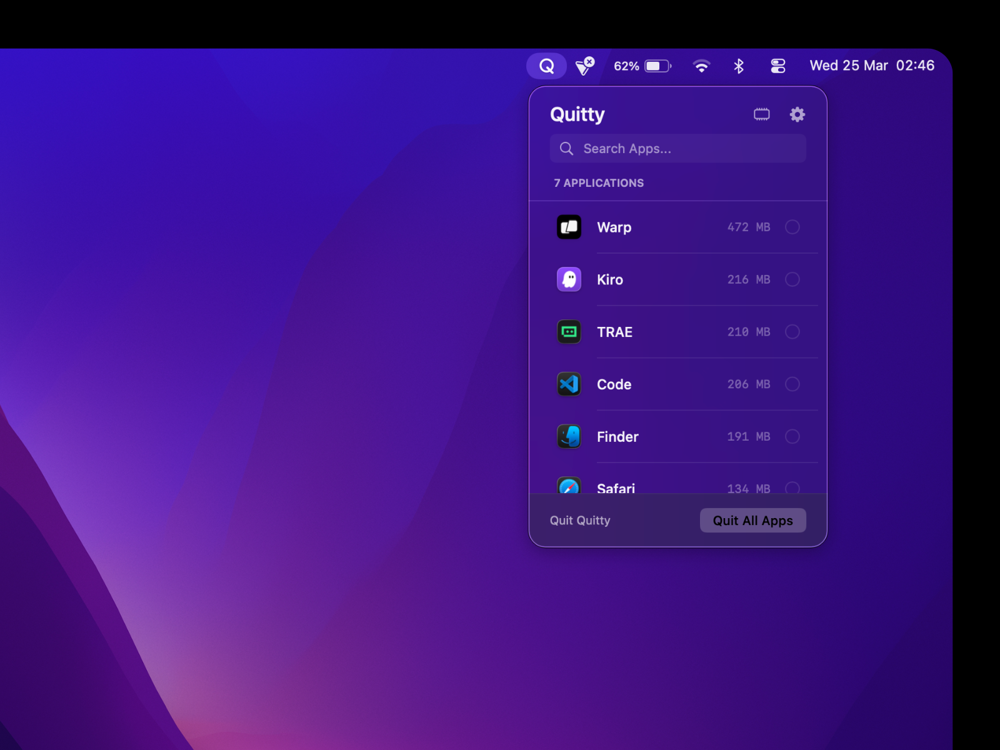
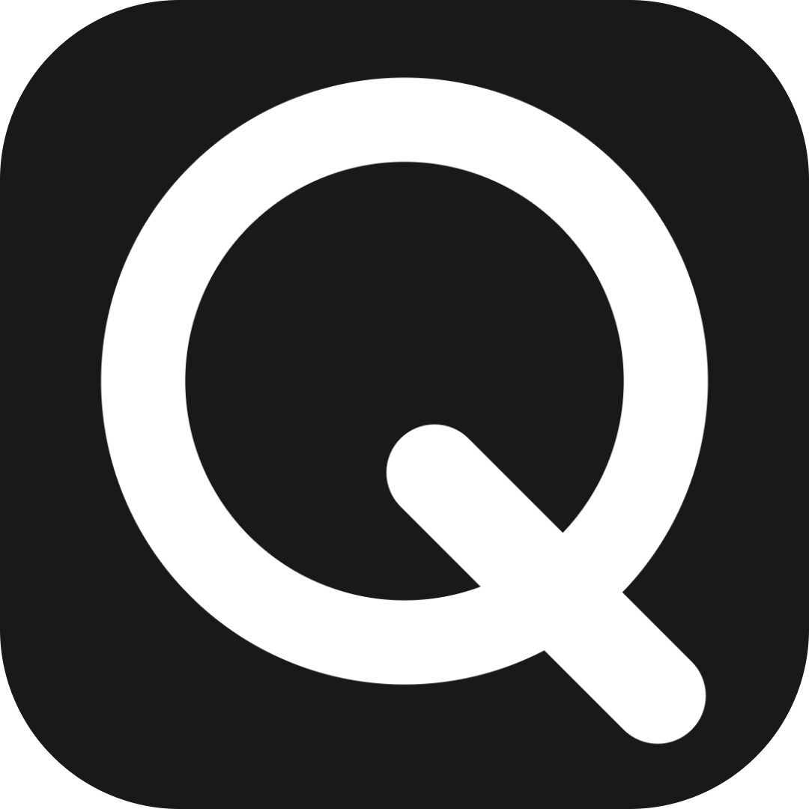

<p align="center">
  



**The ultimate macOS system optimization and cleanup utility**

[](LICENSE)
[](https://developer.apple.com/macos/)
[](https://github.com/iad1tya/Quitty/releases)

[Download DMG](https://github.com/iad1tya/Quitty/releases/download/v1.0.0/Quitty-1.0.0.dmg) • [Install via Homebrew](#installation) • [Report Issues](https://github.com/iad1tya/Quitty/issues)

</div>

## ✨ Features

Quitty is a powerful, all-in-one macOS optimization tool that helps you keep your Mac running at peak performance. With a beautiful and intuitive interface, Quitty provides comprehensive system management tools in one convenient application.

### 🚀 **System Dashboard**
- **Real-time Monitoring**: Live CPU, RAM, disk space, and battery health statistics
- **Quick Actions**: One-click access to all optimization tools
- **Visual Analytics**: Beautiful charts and graphs for system metrics
- **Smart Recommendations**: AI-powered suggestions for system optimization

### 🧹 **System Cleaning**
- **Junk Cleaner**: Removes temporary files, cache, logs, and system junk
- **Trash Manager**: Empty trash from all volumes and user accounts
- **Smart Detection**: Identifies and removes only safe-to-delete files
- **Customizable Categories**: Choose what to clean with detailed file type selection

### 🔍 **File Management**
- **Duplicate Finder**: Scans for duplicate files across your entire system
- **Large Files Scanner**: Find space-hogging files with detailed size analysis
- **Space Lens**: Visual disk space usage with interactive directory maps
- **Safe Deletion**: Preview before deleting with file recovery options

### ⚡ **Performance Optimization**
- **RAM Booster**: Frees up memory by terminating unnecessary processes
- **CPU Monitor**: Track CPU usage and identify resource-heavy applications
- **Startup Manager**: Control which apps launch at startup
- **Battery Health**: Monitor battery status and optimize power usage

### 📊 **Network & Connectivity**
- **Network Monitor**: Real-time network speed and data usage tracking
- **Connection Analysis**: Monitor active connections and network processes
- **Bandwidth Usage**: Track data consumption by application

### ⏰ **Automation & Scheduling**
- **Task Scheduler**: Automate cleaning and optimization tasks
- **Smart Timing**: Schedule tasks during idle periods
- **Notification System**: Get alerts when tasks complete
- **Recurring Tasks**: Set up daily, weekly, or monthly maintenance

### 🛠️ **Advanced Tools**
- **App Uninstaller**: Completely remove applications and their leftovers
- **Process Manager**: View and manage running processes
- **System Information**: Detailed hardware and software information
- **Storage Analyzer**: Deep dive into disk usage patterns

## 🚀 Installation

### Option 1: Direct Download (Recommended)
1. Download the latest DMG from [Releases](https://github.com/iad1tya/Quitty/releases)
2. Mount the DMG file
3. Drag Quitty.app to your Applications folder
4. Launch Quitty from Applications

### Option 2: Homebrew
```bash
# Install Homebrew (if not already installed)
/bin/bash -c "$(curl -fsSL https://raw.githubusercontent.com/Homebrew/install/HEAD/install.sh)"

# Install Quitty
brew install quitty

# Run Quitty
open /Applications/Quitty.app
```

### Option 3: Build from Source
```bash
# Clone the repository
git clone https://github.com/iad1tya/Quitty.git
cd Quitty

# Build the project
xcodebuild -project Bye.xcodeproj -scheme Quitty -configuration Release

# Copy to Applications
cp -R "/Users/$(whoami)/Library/Developer/Xcode/DerivedData/Bye-*/Build/Products/Release/Quitty.app" /Applications/
```

## 📖 Usage Guide

### Getting Started

1. **Launch Quitty**: Open the app from your Applications folder
2. **Dashboard Overview**: The main dashboard shows your system's current status
3. **Navigation**: Use the sidebar to access different features
4. **Quick Actions**: One-click buttons for common tasks

### Dashboard Features

#### System Stats Cards
- **RAM Usage**: Shows current memory usage with percentage and used/total values
- **CPU Usage**: Real-time CPU monitoring with active process count
- **Disk Space**: Storage usage with free space indicator
- **Battery Health**: Battery percentage and cycle count (on supported Macs)

#### Quick Actions
- **Clean Junk**: Removes system junk files and temporary data
- **Empty Trash**: Empties trash from all mounted volumes
- **Free RAM**: Frees up memory by terminating unnecessary processes
- **Find Duplicates**: Starts duplicate file scanning
- **Large Files**: Scans for large files taking up disk space
- **Quit All Apps**: Safely closes non-essential applications

### System Cleaning

#### Junk Cleaner
1. Navigate to **System Junk** in the sidebar
2. Review the detected junk categories:
   - **System Cache**: Application cache files
   - **User Cache**: User-specific cache data
   - **Log Files**: System and application logs
   - **Temporary Files**: Various temporary data
3. Select categories to clean
4. Click **Clean Selected** to remove junk

#### Trash Manager
1. Go to **Trash Bins** in the sidebar
2. View trash from different volumes and users
3. Select which trash bins to empty
4. Click **Empty Selected** to clear trash

### File Management

#### Duplicate Finder
1. Click **Duplicates** in the sidebar
2. Choose scan location (entire system or specific folders)
3. Click **Start Scan** to find duplicates
4. Review results and select files to remove
5. Use **Smart Selection** to keep newest versions

#### Large Files Scanner
1. Navigate to **Large Files** in the sidebar
2. Set minimum file size threshold
3. Select scan location
4. Review large files and delete unwanted ones

### Performance Tools

#### RAM Booster
1. Go to **RAM Booster** in the sidebar
2. View current RAM usage breakdown
3. Click **Free RAM** to optimize memory
4. Monitor the freed memory amount

#### CPU Monitor
1. Click **CPU & Temp** in the sidebar
2. View real-time CPU usage
3. Monitor top CPU-consuming processes
4. Track CPU temperature (on supported Macs)

#### Battery Monitor
1. Navigate to **Battery** in the sidebar
2. View battery health percentage
3. Monitor power consumption
4. Check battery cycle count and condition

### Automation

#### Task Scheduler
1. Go to **Scheduler** in the sidebar
2. Create new scheduled tasks:
   - **Clean Junk**: Automatic junk cleaning
   - **Empty Trash**: Regular trash emptying
   - **Free RAM**: Memory optimization
   - **Find Duplicates**: Periodic duplicate scanning
3. Set frequency (daily, weekly, monthly)
4. Configure notification preferences

## ⚙️ Configuration

### Settings
Access settings by clicking **Settings...** in the menu bar or from the sidebar.

#### General Settings
- **Launch at Login**: Start Quitty automatically
- **Background Monitoring**: Enable system monitoring
- **Update Frequency**: Set data refresh intervals

#### Cleaning Preferences
- **Safe Mode**: Only remove safe-to-delete files
- **Custom Exclusions**: Add files/folders to exclude
- **Backup Options**: Create backups before deletion

#### Notifications
- **Task Completion**: Get notified when tasks finish
- **System Alerts**: Receive system health warnings
- **Sound Effects**: Enable/disable notification sounds

## 🔧 Advanced Features

### App Uninstaller
- **Complete Removal**: Uninstall apps with all associated files
- **Leftover Detection**: Find and remove app leftovers
- **Bundle Analysis**: See what files belong to each app

### Storage Analysis
- **Visual Maps**: Interactive disk usage visualization
- **File Type Breakdown**: See which file types use most space
- **Growth Tracking**: Monitor storage usage over time

### Network Monitoring
- **Real-time Speed**: Monitor upload/download speeds
- **Data Usage**: Track data consumption by app
- **Connection Info**: View active network connections

## 🛡️ Safety & Privacy

- **Safe Cleaning**: Only removes files that are safe to delete
- **Backup Creation**: Automatically creates backups before major operations
- **Privacy Respecting**: No data collection or telemetry
- **Local Processing**: All operations happen on your device

## 📋 System Requirements

- **macOS**: 14.6 (Sonoma) or later
- **Memory**: 4GB RAM minimum (8GB recommended)
- **Storage**: 500MB free space for installation
- **Processor**: Apple Silicon or Intel Mac

## 🤝 Contributing

We welcome contributions! Please see our [Contributing Guidelines](CONTRIBUTING.md) for details.

### Development Setup
```bash
# Clone the repository
git clone https://github.com/iad1tya/Quitty.git
cd Quitty

# Open in Xcode
open Bye.xcodeproj

# Build and run
xcodebuild -project Bye.xcodeproj -scheme Quitty -configuration Debug
```

## 📝 Changelog

See [CHANGELOG.md](CHANGELOG.md) for a detailed history of changes.

## 🐛 Bug Reports & Feature Requests

- **Bug Reports**: [File an issue](https://github.com/iad1tya/Quitty/issues/new?template=bug_report.md)
- **Feature Requests**: [Suggest a feature](https://github.com/iad1tya/Quitty/issues/new?template=feature_request.md)
- **Questions**: [Start a discussion](https://github.com/iad1tya/Quitty/discussions)

## 📄 License

This project is licensed under the MIT License - see the [LICENSE](LICENSE) file for details.

## 🙏 Acknowledgments

- **Apple**: For the macOS platform and development tools
- **SwiftUI Community**: For inspiration and best practices
- **Open Source Contributors**: For making this project possible

## 🔗 Links

- **Website**: [https://quitty.iad1tya.cyou](https://quitty.iad1tya.cyou)
- **Documentation**: [Wiki](https://github.com/iad1tya/Quitty/wiki)
- **Twitter**: [@xad1tya](https://x.com/xad1tya)

---

## Support the Project
  <a href="https://buymeacoffee.com/iad1tya"></a>
  &nbsp;
  <a href="https://intradeus.github.io/http-protocol-redirector/?r=upi://pay?pa=iad1tya@upi&pn=Aditya%20Yadav&am=&tn=Thank%20You"></a>
</div>

</div>

## License
Quitty is open-source and free to use.
